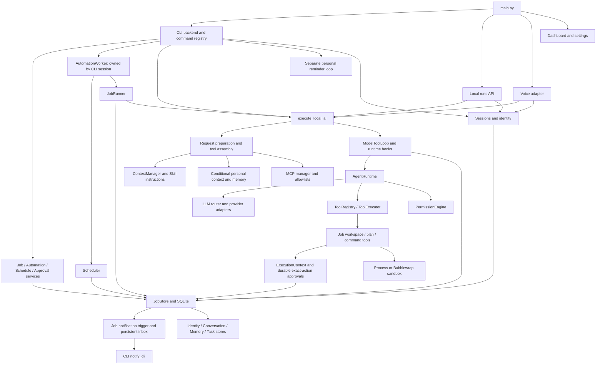

# Runtime dependency audit

Audited on 2026-10-07 against commit
`10bbc73d540b67624d9d1529d7a6f6c41893675e` with a clean initial worktree.
[spec.md](../spec.md) is the governing runtime refactor contract. This audit
preserves the completed Automation design and documents current dependencies;
it does not implement the target architecture.

## Scope and method

Read the repository instructions, `spec.md`, `README.md`,
[operations](operations.md), [agent runtime](agent-runtime.md),
[Skills](skills.md), [AI package](../ai/README.md), and
[developer capability](../capabilities/developer/README.md) documentation.
Enumerated Python modules and inspected imports with Python AST, then followed
call sites, tool registration/filtering, SQL relationships, lifecycle handlers,
and corresponding tests. The component tables cover all nine requested
directories; supporting packages are included where those paths depend on them.
Package `__init__.py` files follow their exports' classifications, with mixed
facades classified Shared.

Evidence below refers to repository code and deterministic tests. No live LLM,
external service, private configuration, user Skill directory, or user database
was inspected. Test-created temporary databases are verification fixtures.
Absence of a repository call site is not proof that an installed extension or
external Python caller does not use an exported API.

| Classification | Meaning in this audit |
| --- | --- |
| Core Automation | Executes or safeguards the Job/Automation lifecycle required by the contract. Keep. |
| Shared | Used by runtime and assistant adapters, or currently required by common imports, store composition, configuration, or API contracts. Preserve until callers are separated. |
| Personal Assistant Only | Its observed behavior serves chat, personal memory/tasks/reminders, or voice; any import coupling still needs removal before deleting its module. |
| Optional | Advanced behavior the contract explicitly permits disabling. Keep existing persistence and lifecycle dependencies until isolated. |
| Unknown / Needs Review | Repository evidence does not justify a removal decision or establish the required execution path. Keep and record the unresolved question. |

## Current dependency map

This is the observed graph, not a proposed redesign. Personal prompt retrieval
and personal tool handlers are conditional; their imports are not conditional.
The Worker itself does not import CLI, conversation, or reminder modules, but
its production owner currently lives in the CLI backend.

### End-to-end paths and evidence

| Path | Observed execution, persistence, failure handling, and result |
| --- | --- |
| Job submission | [`commands._run`](../interfaces/cli/commands.py#L234) → [`JobService.submit`](../application/automation.py#L45) validates prompt/secrets/workspace → `JobStore.create_job` persists a queued job → optional worker wake. CLI reports the ID and worker availability, not completed execution. Covered by `tests/interfaces/test_cli_jobs.py` and `tests/automation/test_public_automation.py`. |
| Saved automation | [`AutomationService`](../application/automation.py#L209) → definition validation → `create_automation` / `revise_automation` / `create_automation_job` → immutable version records, rendered parameters, workspace and permission snapshot. [`JobRunner`](../workflows/runtime/runner.py#L208) resolves the job's pinned automation and Skill versions. Covered by `test_reusable_automations.py` and `test_scheduled_automation_execution.py` under `tests/automation/`. |
| Schedule and retry | [`ScheduleService`](../application/automation.py#L129) → [`Scheduler.create/create_automation/tick`](../workflows/runtime/scheduler.py#L170) → [`fire_schedule`](../workflows/storage/store.py#L2197) or `retry_trigger`. Occurrence identity, materialized job, parameters, trigger history and schedule advancement commit atomically. Retry uses the same logical job and a new claimed attempt. UTC/ZoneInfo and stored schedule timezone govern timing. Tests cover pinning, explicit upgrade, missed runs, rollback, concurrent ticks and crash boundaries in `tests/automation/test_scheduled_automation_execution.py`. |
| Worker and recovery | [`AutomationWorker.start`](../workflows/runtime/worker.py#L113) acquires the database's advisory lock before recovery, heartbeat, child reconciliation, scheduler tick, retention and atomic job claim. [`claim_next_job`](../workflows/storage/store.py#L772) enforces quotas/concurrency and commits the attempt record. Runner cancellation persists interruption unless already cancelled; worker shutdown cancels/awaits tasks and releases ownership. `tests/automation/test_automation.py` and `test_hardening.py` cover cancellation, safe resume, locks, backup, migration rollback and restart. |
| AI execution | [`JobRunner.run`](../workflows/runtime/runner.py#L184) builds a pinned `ExecutionContext`, budgets and durable callbacks, then passes an `AgentRequest` to `execute_local_ai` without `AssistantContext`, conversation history or session ID. Executor → `prepare_request` → `build_runtime_tools` → `ModelToolLoop` → `AgentRuntime` → provider/tool rounds. Completion checks budget, children, verification after writes and durable plan status before committing a job result. Transient retries stop after side effects. Covered by `tests/ai/test_ai_workspace.py`, `tests/automation/test_automation.py`, and `tests/automation/test_scheduled_automation_execution.py`. |
| Durable job approval | Workspace write/command handler → [`ExecutionContext.require_approval`](../workflows/runtime/context.py#L114) → [`JobRunner.require_approval`](../workflows/runtime/runner.py#L156) → [`request_or_consume_approval`](../workflows/storage/store.py#L1304). Unapproved exact action persists a request and moves the job to waiting approval; no action is executed. CLI `ApprovalService.decide` validates the request through the store, optionally wakes the worker, and the next execution consumes one matching, unexpired approval. Denial, changed actions, expiry and cancellation invalidate/block execution. Covered by `tests/automation/test_approvals.py` and the scheduled-job approval test. |
| Notification | Committed job status transition → [`job_notification` trigger](../workflows/storage/migrations.py#L392) → `notifications` → [`OperationsStore` queries/ack](../workflows/storage/operations.py#L153) → optional [`notify_cli`](../interfaces/cli/operations.py#L88), enabled by `SUTO_NOTIFY_CLI`. Delivery uses fixed safe summaries, suppresses obsolete approval messages, acknowledges after output, and retries acknowledgement without reprinting in the same session. Inbox creation does not require a live CLI. Covered by `tests/automation/test_result_notifications.py` and `tests/interfaces/test_cli_live_notifications.py`, including transaction rollback and offline/restart delivery. |

## Component classification

### Assistant, agent, and application

| Component | Classification | Dependency evidence and decision |
| --- | --- | --- |
| `assistant/context.py`, assistant facade | Shared | `AssistantContext` is imported by executor, request preparation, tool assembly, CLI, API and voice. Worker requests omit it, but deleting it breaks imports. `DeliveryTargetContext` is personal delivery data; detach it only with its callers. |
| `assistant/identity/{models,store}.py` | Shared | [`JobStore`](../workflows/storage/store.py#L80) inherits `IdentityStore`; CLI/API/voice resolve isolated identities. CLI schedule commands read `context.user.timezone` at [`commands.py:425`](../interfaces/cli/commands.py#L425). Profile timezone and interface/user isolation must survive removal of personal preferences. See `tests/assistant/test_assistant.py`, `tests/interfaces/test_api.py` and `tests/interfaces/test_cli_schedules.py`. |
| `assistant/conversations/{models,store}.py` | Shared | Inherited by `JobStore`; [`SessionStore`](../sessions/store.py#L12), API and CLI call it. `agent_runs`, `session_skills` and nullable `run_events.session_id` reference conversations. Chat viewing/clearing is personal behavior, but whole-store removal currently breaks API run ownership/history and imports. See `tests/assistant/test_sessions.py`, `tests/agent/test_run_persistence.py`. |
| `assistant/memory/{service,tools}.py`; personal memory records | Personal Assistant Only | [`prepare_request`](../ai/execution/request.py#L196) retrieves user memory only with `AssistantContext`; [`assembly`](../ai/tooling/assembly.py#L53) builds memory handlers only for that context. Production `JobRunner` supplies neither. Imported through shared AI and tools facades; detach those registrations/imports before module removal. `tests/assistant/test_memory.py` verifies isolation and retrieval; `tests/ai/test_ai_core.py` verifies safe retrieval failure. |
| `assistant/memory/{models,store}.py` as complete modules | Shared | `MemoryStore` is a `JobStore` base class and includes `SessionSummary` CRUD alongside personal memory CRUD. The prompt adapter calls `get_session_summary`, and SessionStore compaction uses the same summary table; removing the entire module also removes that session path. Individual personal-memory behavior is a candidate, not the mixed module as-is. |
| `assistant/tasks/{models,store,tools}.py` | Personal Assistant Only | CLI task/reminder commands and personal delivery use these APIs; AI/tool facades import schemas and reminder-completion checks. `TaskStore` remains a `JobStore` base class. No Worker/Scheduler business call to personal task/reminder methods was found. `tests/assistant/test_assistant.py` and `tests/interfaces/test_cli.py` cover them. Unlink composition and imports before removing Python modules; keep legacy tables/migrations. |
| Retired briefing behavior | Personal Assistant Only | No active briefing module or worker exists. [`migrations.py:201`](../workflows/storage/migrations.py#L201) explicitly retains historical briefing tables for compatibility; `test_version_seven_database_retains_legacy_briefing_schema` in `tests/automation/test_hardening.py` enforces that. Those migration statements are not removable dead code. |
| `agent/runtime.py`, `types.py`, `state.py`, `events.py`, `limits.py` | Core Automation | Provider-neutral bounded execution, tool schema validation before permissions, strict authorization, safe events and terminal results. Shared executor calls this runtime for jobs as well as chat. No concrete CLI/assistant/database import in `runtime.py`. `tests/agent/test_runtime.py`, `test_model_adapter.py` and `tests/automation/test_scheduled_automation_execution.py` provide boundary evidence. |
| `agent/subagents.py` | Optional | [`ModelToolLoop`](../ai/execution/loop.py#L276) installs `SubAgentManager` only when `agent.delegate` is selected. It intersects parent tools/permissions/Skills and budgets; tests in `tests/agent/test_subagents.py` cover denial/cancellation. Its unconditional import is still a shared executor dependency. Do not confuse it with durable child jobs below. |
| `application/automation.py`: JobService, ScheduleService, AutomationService, ApprovalService | Core Automation | These services validate/read/mutate workflow state and optionally wake/cancel the worker. No personal assistant import. Constructors support a store without a worker, but that alone does not supply an independent production worker process. |
| `application/configuration.py` | Shared | CLI/API/voice profile startup and web editor use the parser/atomic writer; schedule CLI needs timezone. `VoiceSettings` is personal-only within this mixed module. Tests: `tests/application/test_configuration.py`, `tests/interfaces/test_web.py`. Preserve version validation, timezone handling, environment fallbacks and atomic writes. |
| `application/settings.py` | Shared | Validated environment readers supply provider and job limits; imported by `ai/config.py`, `workflows/runtime/context.py`, and runner. Not merely dashboard settings. |
| `application/modes.py` | Shared | Both jobs and interactive AI call `get_mode_policy('agent')`; default policy text and personal-tool sets are mixed with runtime filtering. Preserve the single-mode contract and safe filtering while later removing assistant wording/sets. `CLARIFICATIONS_ENABLED=False` parks clarification pending a working persistent interface path. |
| `application/language.py` | Shared | Job `prepare_request` chooses reply language; prompting and final response correction also call it. It is not only the chat language UI. Keep its current dependency until runtime output behavior is explicitly separated. |
| `application/skill_proposals.py` | Optional | CLI `/skill-proposal` calls this service, backed by `SkillProposalStore`; Worker/Scheduler do not invoke detection or publication. Tests: `tests/automation/test_skill_proposal_foundation.py`, `test_skill_proposal_approval.py`, `test_repeated_workflow_detection.py`. |

### Interfaces

| Component | Classification | Dependency evidence and decision |
| --- | --- | --- |
| `main.py` entry dispatch | Shared | Supports CLI, `setting`, API and voice; no `worker` entry point. Imports interface implementations only after argument selection. See `tests/interfaces/test_main.py`. Keep dispatch/config bootstrap while later retiring selected surfaces. |
| `interfaces/cli/backend.py` | Shared | [`run_session`](../interfaces/cli/backend.py#L101) currently creates identity/session, then Worker/Runner, job notification task and personal reminder task. `finally` at line 386 stops the worker with the CLI. Removing chat orchestration before preserving this owner would stop job/schedule execution. |
| `interfaces/cli/commands.py` registry/context | Shared | Public job, automation, schedule and approval handlers coexist with personal commands and chat Skill UX. Job handlers depend on services and profile timezone; the registry is the only current public workflow command route. Remove handlers individually, not the registry. Tests: `test_cli_jobs.py`, `test_cli_schedules.py`, `test_cli_skill_proposals.py` under `tests/interfaces/`. |
| CLI `_task`, `_reminder`, `_clear`, `_reset`; `reminder_input.py` | Personal Assistant Only | Explicit handlers at [`commands.py:594`](../interfaces/cli/commands.py#L594) onwards call personal persistence; none executes jobs. Candidates after retaining the command dispatch and profile needed by workflow handlers. `_reset` calls a database-wide conversation reset; deleting its surface must not delete stored data during refactor. |
| `interfaces/cli/app.py`, `output.py`, `progress.py` | Shared | CLI input and output also display command/job/notification/approval results. [`capabilities/developer/cli.py`](../capabilities/developer/cli.py#L15) imports output/progress. Preserve an operational CLI and usable approval/delivery path before changing presentation. |
| `interfaces/cli/history.py`, `language.py`; chat fallback in backend | Personal Assistant Only | Prompt display/history and interactive language continuity feed the chat request path. Backend calls sessions/AI on non-command messages at line 206 onwards. `app.py` still imports `HistoryWindow`; replace that caller before removing history. Language implementation in `application/` remains Shared. |
| `interfaces/cli/skill_catalog.py`; `/skills`, `/skill activate/deactivate`, `/<skill> <message>` | Personal Assistant Only | CLI discovery/session selection passes registry Skills into chat. Backend binds `SkillSelection` to its conversation; [`handle_command`](../interfaces/cli/commands.py#L823) resolves one-request skill invocations. This is distinct from pinned SQLite automation Skills. Preserve loader/registry and automation Skill execution. |
| `interfaces/cli/operations.py`: `notify_cli` and inbox summaries | Core Automation | Actual delivery path for durable job result/approval/retry notifications. Backend starts it optionally. Covered by live notification tests; notification acknowledgements must continue to reflect confirmed delivery. |
| `interfaces/cli/operations.py`: personal reminder helpers/loop | Personal Assistant Only | `notify_personal_reminders` and `print_due_reminders` at [`operations.py:132`](../interfaces/cli/operations.py#L132) use `TaskStore.claim_due_reminders`, independent of Scheduler/jobs/inbox. Remove only this loop and its personal helpers/callers. |
| `interfaces/cli/operations.py`: `handle_operations` | Unknown / Needs Review | Implements health/backup/limits/logs/knowledge/subtasks/notifications, but no call from production `run_session` or public command registry was found. `test_operator_cli_validation_and_preview` in `tests/automation/test_hardening.py` calls it directly. Current `/notifications` is a helper implementation, not a registered public command. Keep runtime operations APIs; decide the intended public route before removing or exposing the wrapper. |
| `interfaces/api/server.py` | Shared | [`create_app`](../interfaces/api/server.py#L153) uses JobStore, identity, SessionService, conversation ownership and session Skills. `/runs` launches in-process executor tasks and persists `agent_runs`; it does not call JobService/AutomationService or start Scheduler/Worker. Existing cancellation/SSE/recovery/security contracts are tested in `tests/interfaces/test_api.py`. Preserve the adapter until a separately authorized contract change; it is not a durable Job API today. |
| `interfaces/voice/*` | Personal Assistant Only | `main.py voice` → factory/controller → capture/STT → shared executor → sanitized TTS/playback. No Worker/Scheduler caller and no automation worker started. [`test_runtime_imports_no_voice_types`](../tests/interfaces/test_voice.py#L344) guards runtime separation. All voice-local modules are candidates with dispatch/config/docs cleanup; shared sessions, broker, providers and persistence are not voice-specific. |
| `interfaces/web/history.py`; dashboard history UI in `static/*` | Personal Assistant Only | Read-only local CLI conversation viewer. `tests/interfaces/test_web.py` verifies history isolation, pagination and no database creation for an absent database. Candidate after removing corresponding routes/UI. |
| `interfaces/web/{server,settings}.py`; settings UI in `static/*` | Shared | Dashboard and authenticated settings editor share the server/assets; settings reads/writes validated profile including runtime schedule timezone. Provider/model already live in environment config, not this editor. Preserve configuration access and host/origin/session protections until another authorized settings path exists. Do not delete all web assets solely because the chat tab is personal. |

### Workflows, Skills, tools, permissions, and sandbox

| Component | Classification | Dependency evidence and decision |
| --- | --- | --- |
| `workflows/models.py`, `errors.py` | Core Automation | Job/attempt/result/approval/schedule/automation/Skill contracts and structured safe error codes used throughout services, storage, runner and CLI. Optional proposal contracts share `models.py`; no whole-module removal. |
| `workflows/runtime/{worker,scheduler,runner,context,options,checkpoints}.py` | Core Automation | Lock/claim/recovery, timezone schedules, budgets, tool permissions, exact approvals, workspace identity/hashes and result transitions. See end-to-end map. Checkpoint validation is shared with JobService resume and must precede resumed side effects. |
| `workflows/storage/store.py` | Shared | Core workflow persistence facade also inherits all four assistant stores, RunStore, OperationsStore, SubtaskStore, KnowledgeStore and SkillProposalStore. Deleting any imported base class breaks jobs at import time even when its methods are not called. Preserve transaction/connection safety and workflow APIs. |
| `workflows/storage/{migrations,locking}.py` | Core Automation | Schema version 23, pre-upgrade online backup, version transactions, newer/partial-schema refusal and migration/worker advisory locks. Historical assistant tables remain compatibility obligations. `tests/automation/test_hardening.py` and migration/recovery tests validate these paths. |
| `workflows/storage/{operations,redaction}.py` | Shared | Runtime settings, quotas, diagnostics/metrics, logs, backup, retention and inbox are core; cleanup also redacts optional rejected proposals. Redaction is reused by assistant, API, voice and tool audit. Keep unread-notification and resumable-job safeguards. |
| `workflows/storage/runs.py` | Shared | `agent_runs` ownership/recovery and session Skill persistence serve CLI/API/voice; `JobStore` inherits the mixin. Job attempts use separate job/attempt state, while job runtime trace helpers live in `store.py`. `tests/agent/test_run_persistence.py` covers process ownership, restart and session reservations. |
| `workflows/storage/knowledge.py` | Core Automation | Opt-in workspace index/search through `tools.advanced`, with workspace scoping, symlink rejection, redaction, quotas, citations and staleness checks. It is not personal memory. `tests/automation/test_advanced.py` verifies index integrity and privacy. |
| `workflows/storage/subtasks.py`; subtask portion of `tools/advanced.py` | Optional | Durable child jobs require `options.subtasks`; the Worker nonetheless always calls `reconcile_children`, and Runner always calls `reserved_budget` and `wait_for_children`. Parent cancellation, shared quotas and restart state depend on these methods even with the feature unexposed. Preserve handling of existing child jobs before isolating it. See `tests/automation/test_advanced.py`. |
| `workflows/storage/skill_proposals.py` | Optional | Detection/publication is explicit and not executed by worker ticks. However JobStore inherits it and `OperationsStore.cleanup` always queries proposal tables. Publication atomically creates a versioned Skill with provenance checks. Optional exposure does not imply safe module/table deletion. |
| `workflows/library/{definitions,bundles}.py` | Core Automation | Definition/parameter/prompt/Skill/workspace validation plus validated export/import; called by services and storage. Keep version pinning and secret rejection. Tests: `tests/automation/test_reusable_automations.py`, `test_public_automation.py`. |
| `skills/{types,loader}.py`; `SkillRegistry` and `builtin_registry` in `registry.py` | Shared | AI preparation always resolves a registry; active Skill allowlists intersect tools/MCP and context builder renders instructions. Builtins are reusable instruction documents, not executable handlers. `tests/agent/test_skills.py` proves they cannot grant permissions or bypass registration. Keep the framework. |
| `SkillSelection` in `skills/registry.py` | Shared | Session activation is chat UX, but voice uses this class and API uses the same `session_skills` persistence through RunStore. It shares a module with core registry discovery. Remove session selection only after all adapter consumers are retired or separated. |
| SQLite automation Skills (`workflows.models.Skill/SkillVersion`, store APIs) | Core Automation | `automation_version_skills` pins version IDs; Runner retrieves and passes their instructions into ContextManager as `skill_instructions`, without CLI selection. Tests: `tests/automation/test_reusable_automations.py`, `test_scheduled_automation_execution.py`. Never delete these when retiring chat Skills. |
| `tools/{base,types,registry,executor}.py` | Core Automation | Registered handlers, schemas, normalized results and grant-required execution underpin AgentRuntime. Tests in `tests/agent/test_runtime.py` cover invalid arguments before permission checks, strict grants and failure results. |
| `tools/__init__.py` | Shared | Global registration/schema/guidance facade eagerly imports personal task/memory, workspace and native domain tools. `get_tools` builds request subsets; importing only `tools.registry` still executes package initialization. Remove personal entries and imports coherently, not the facade. |
| `tools/advanced.py`: retrieval portion | Core Automation | Job option `retrieval` selects `index_project/search_project`, and handlers require `ExecutionContext` authorization before KnowledgeStore access. Subtask functions in the same module are Optional. |
| `tools/delegation.py` | Optional | Schema/name for `agent.delegate`; tools facade registers it and the loop installs its request-scoped handler. Keep imported schema until optional exposure is separated. |
| `tools/clarification.py` | Shared | Parsed clarification contract/hooks remain in the shared loop, although current mode parks exposure. Missing-input clarification is an explicit safeguard, not removable general chat behavior. Tests: `tests/ai/test_ai_core.py` for parked clarification; durable planning tool tests cover a separate retained capability. |
| `tools/datetime_tool.py`, `tools/search/*` | Shared | Native datetime/web/search/research handlers are registered and available to interactive adapters. Job `_allowed_tools` currently returns only authorized job-scoped names; ordinary Runner does not select these native assistant names. Search/fetch is also reused by `tools/web/operations.py`; keep URL/DNS/redirect/size/timeout controls. Tests: `tests/tools/test_datetime_tool.py`, `test_search.py`, `test_search_pipeline.py`, `test_web.py`. Lack of default job exposure is not grounds to remove tool capabilities required by the contract. |
| `tools/file_reader/*` | Shared | Attachment tools, document cache/index/retrieval/extraction/tokenization/summarization are eagerly imported through tools and assembled by AI. CLI/API do not currently supply job attachments, but executor supports them; these APIs have direct tests in `tests/tools/test_file_reader.py`. Keep until attachment support is explicitly decided; do not conflate document retrieval with personal memory. |
| `tools/{filesystem,git,python,terminal,web}/*` domain facades | Unknown / Needs Review | `tools.ALL_TOOLS/ALL_TOOL_SCHEMAS` exports namespaced and alias tools; `tests/tools/test_domain_registry.py` calls their dispatch directly. Neither the current interactive allowlist nor Runner's job allowlist selects those facade names. Generic filesystem/shell/code implementations do not use the job's exact-action approval/containment/sandbox chain. Their external use/required future surface is not established by repository call sites. Preserve existing disabled exposure; neither delete nor enable them in this audit. |
| `permissions/{models,policy,engine,approvals}.py` | Core Automation | Fail-closed policy and exact approval values used by runtime and `ExecutionContext`. `PermissionPolicy` defaults to deny; executor explicitly permits only the selected registry. `tests/agent/test_permissions.py` and `tests/automation/test_approvals.py` verify boundaries. |
| `permissions/broker.py` | Shared | Live run-scoped approval handshake used by AgentRuntime/PermissionEngine and CLI/voice; pending entries expire/cancel and are memory-only. API supplies no interactive submission path and fails closed. It is distinct from durable job approval storage and cannot be deleted as voice-only UI. `tests/agent/test_interactive_approvals.py` verifies it. |
| `sandbox/{runtime,__init__}.py` | Core Automation | `SandboxPolicy` selects process/Bubblewrap command isolation after job authorization. Bubblewrap capability failure has no process fallback. Namespace/mount/resource controls and process backend behavior are tested by `tests/tools/test_sandbox.py`. |
| `capabilities/developer/workspace/*`, `command.py`, `sandbox.py`, `planning.py` | Core Automation | Job-specific read/search/list, approved atomic patches, contained verification commands, process-tree cleanup and durable plan steps. Despite the package's “parked” wording, these are called by shared tool assembly for real jobs. Tests: `tests/tools/test_workspace_tools.py`, `test_command_tools.py`, `test_planning_tools.py`. |
| `capabilities/developer/cli.py` | Shared | Public backend imports its compatibility parsing/presentation exports; tests call the parked parsers and job presentation helpers directly. Some operations are parked, but module-wide deletion would break CLI imports; determine unused symbols individually later. |

### Supporting packages that cannot be omitted

| Component | Classification | Evidence |
| --- | --- | --- |
| `ai/executor.py`, `execution/*`, `tooling/*`, `client.py`, `config.py`, `models.py`, `prompting.py`, `progress.py`, `response.py`, `tool_runtime.py` | Shared | Stable job/interactive executor path owns provider sessions, MCP cleanup, request policy, safe errors, budgets and observability. Personal branches/imports in request/assembly/loop must be removed individually. Final language enforcement also runs for jobs. `ai/models.py` imports the optional interactive `Plan` contract. |
| `ai/providers/*`, `llm/*` | Core Automation | Ollama/OpenAI-compatible protocol adapters, normalized Model request/result and router used by shared loop. `ai/providers/model.py` also supplies a compatibility adapter; tests in `tests/agent/test_model_adapter.py` exercise that interface. Keep provider behavior and configuration. |
| `context/{builder,budget}.py`, context facade | Shared | ContextManager builds all job prompts, including pinned automation Skill instructions; generic context budgets/retrieval records are not solely personal memory. [`builder.skills`](../context/builder.py#L85) keeps guidance subordinate to permissions. |
| `context/compactor.py`, `sessions/{service,store}.py` | Shared | Current API/CLI/voice use persisted conversations, bounded history and summaries. Worker omits session context, but these modules are still imported by the executor hook path and API. They are candidates only after those adapter paths are separated. |
| `retrieval/memory.py` | Personal Assistant Only | MemoryRetriever wraps per-user PersistentMemory and is called only with personal context in preparation. Its imports propagate through the retrieval package facade and shared executor. Remove that adapter/import, not generic retrieval result/error contracts. |
| `retrieval/base.py`, retrieval facade | Shared | `ContextManager` imports RetrievalResult and executor catches RetrievalError. The facade also eagerly imports MemoryRetriever. Keep base contracts while detaching personal retrieval. |
| `mcp_integration/*` | Core Automation | Explicit trusted configuration → filtered server startup → discovery/schema adapter → ToolRegistry/permissions → request cleanup. [`eligible_mcp_config`](../ai/execution/request.py#L36) intersects server, job and Skill allowlists. Tests in `tests/mcp/test_integration.py` exercise local stdio, denial, validation and cancellation. The stdio server is a trusted host process, not the job Bubblewrap command sandbox. |
| `planning/*` | Optional | Interactive tool-free Planner/Replanner runs only without ExecutionContext at [`loop.py:227`](../ai/execution/loop.py#L227); invalid plans fall back. Imports/result contracts remain shared. This is distinct from required durable job plan tools and checkpoints. `tests/agent/test_planning.py` covers it. |

## Direct versus transitive personal-assistant dependencies

| Audited consumer | Direct business use | Transitive coupling that must be preserved or detached |
| --- | --- | --- |
| Worker | No personal task/reminder/chat/memory call. Uses scheduler, runner, store, locks and durable children. | JobStore inherits assistant stores; Runner imports shared AI/tools. Production startup/shutdown is inside CLI session. |
| Scheduler | No personal reminder or memory use. Receives timezone explicitly. | JobStore composition; CLI ScheduleService caller obtains default timezone from persisted user/profile. |
| AgentRuntime | No assistant module, personal session store, CLI, voice, concrete provider or SQLite import. | Importing its ToolRegistry/ToolExecutor reaches eager `tools/__init__.py`; executor hooks/preparation import assistant/sessions. Its runtime loop remains provider-independent. |
| JobService | No personal store method calls. | JobStore inheritance and checkpoint helpers; optional Worker reference. |
| AutomationService | No personal store method calls. Uses definition/version/Skill/workspace persistence. | Same JobStore composition and library/storage validation. |
| Durable ApprovalService | No personal task, reminder, conversation or identity requirement in its mutation path. Actor is supplied as CLI text. | JobStore, workflow models, ExecutionContext → PermissionEngine → runner callback. Shared permission package also exports live ApprovalBroker. |
| Job Notifications | Job IDs and committed status transitions; no personal reminder/user identity or delivery-target FK. | Inbox queries belong to JobStore/OperationsStore; current automatic delivery is CLI-owned and shares a module with personal reminders. |

The principal lifecycle coupling is established, not speculative: closing the
CLI executes `worker.stop()`. API and voice startup do not replace this worker.
Worker independence is subsequent implementation work, not achieved by this
audit or by the existing API's run recovery.

## Persistence boundaries

| Data | Classification and preservation requirement |
| --- | --- |
| `jobs`, `job_attempts`, `job_events`, `tool_events`, `change_events`, `command_events`, `job_steps`, `job_stats`, `daily_usage` | Core Automation. Preserve results/errors, quotas, usage, verification/checkpoints and parent/child state. |
| `automations`, `automation_versions`, `automation_run_parameters`, `automation_version_skills`, `skills`, `skill_versions` | Core Automation. Pinned Skill versions and rendered run parameters are unrelated to chat session selection. |
| `schedules`, `schedule_automation_snapshots`, `trigger_history` | Core Automation. Preserve immutable snapshots, occurrence identity, retry history, missed-run handling and explicit upgrades. |
| `approval_requests`, `approval_events`, `notifications` | Core Automation. Job FKs, exact approval digests/consumption/expiry and atomic notification creation remain. Notifications are not `reminder_deliveries`. |
| `runtime_settings`, `worker_state`, `structured_logs`, `schema_migrations` | Core Automation. Preserve ownership/heartbeat, limits, observability, migrations, WAL/foreign-key handling, online backups and recovery locks. |
| `knowledge_files`, `knowledge_chunks` and FTS backing tables | Core Automation workspace retrieval. Do not remove as personal memory. |
| `run_events` | Shared with core job observability. `job_id` references jobs; nullable `session_id` references conversations, both with cascade deletion. Deleting conversations can delete attached session traces; keep the table and job trace path. |
| `agent_runs`, `session_skills`, `users`, `channel_identities`, `conversations`, `messages`, `session_summaries` | Shared current CLI/API/voice identity/session/run contracts. `agent_runs` and `session_skills` depend on conversations; conversations depend on users. A whole chat-table removal is not safe while `/runs` still uses this ownership model. |
| `assistant_memories`, `assistant_memories_fts`, `assistant_tasks`, `reminders`, `reminder_deliveries`, `delivery_targets`, personal `user_preferences` | Personal behavior candidates. Existing SQL/migration relationships still require preservation during this audit. `session_summaries` in MemoryStore is separately Shared. |
| `briefing_deliveries`, `external_briefing_deliveries` | Retired personal behavior; historical compatibility schema is explicitly retained and tested. No active briefing runtime found. |
| `skill_draft_proposals`, `skill_proposal_events` | Optional feature data. Cleanup/publication/provenance/deduplication still depend on these tables. Preserve reviewed/pending records and generated core Skill versions. |

Sources: base schema in [`JobStore._initialize`](../workflows/storage/store.py#L117),
incremental schema in [`migrations.py`](../workflows/storage/migrations.py),
run ownership in [`RunStore`](../workflows/storage/runs.py), and
[retention queries](../workflows/storage/operations.py#L109).
No schema or migration change is proposed here. No existing database data is
declared safe to drop based solely on a Python component classification.

## Removal candidates and prerequisites

“Candidate” means removable behavior under the governing contract once the
listed callers are detached and retained paths verified. It does not mean an
unconditional file deletion is safe in the current tree. Nothing was removed.

| Candidate | Evidence of separation | Required retained boundary before removal |
| --- | --- | --- |
| General chat fallback, `/clear`, `/reset`, chat display/history | Backend chat branch and commands are separate from JobService submissions; Runner receives no history. | Preserve CLI job/automation/schedule/approval commands, profile timezone, worker ownership and inbox delivery; preserve current API session/run ownership until separately addressed. |
| Personal task/reminder commands, tools and delivery loop | Worker/Scheduler use jobs/schedules; personal loop uses TaskStore, not job notifications. | Detach backend reminder task, command handlers, AI reminder finalization, mode/tool schema registrations and TaskStore inheritance. Keep scheduler, job notification delivery and shared permission/approval behavior. Leave legacy data/schema intact. |
| Personal memory CRUD/tools/retriever/prompt injection | Runner omits AssistantContext; retrieval and handler installation are context-gated. | Detach request/assembly/tools/retrieval-facade imports and registrations; retain ContextManager, generic retrieval contracts, workspace knowledge index and currently shared session summary methods. |
| Voice-local modules, STT/TTS/microphone/playback/presentation | Only the voice entry route and voice tests call them; no automation caller. | Remove voice dispatch and voice-specific config/UI/documentation together when authorized. Preserve shared executor, LLM HTTP provider, sessions/run records and ApprovalBroker. |
| Dashboard chat viewer routes/history/assets | Web history is read-only conversation viewing; no job worker path. | Preserve settings server/editor/config parser and required configuration access; split mixed assets/routes before deleting complete files. |
| Chat Skill command routing and session-only selection | SQLite automation Skill versions flow independently through Runner → ContextManager. | Preserve Skill loader/registry/tool intersections/MCP restrictions and pinned automation Skill tables/APIs. API/voice also persist session selections; handle those callers before deleting selection code. |

Optional Skill proposal/detection/delegation features are **not removal
candidates for this round**. Their exposure can be separated later without
redesigning core Automation. Durable subtask compatibility is especially
important because Worker/Runner call child lifecycle/budget methods regardless
of whether a new job opts in.

### Third-party dependency retention

| Dependency or host program | Actual import/use | Audit decision |
| --- | --- | --- |
| `aiohttp` | Providers/executor/search, API/web and voice speech | Shared; voice/dashboard removal cannot remove runtime HTTP support. |
| `python-dotenv` | `main.py` configuration bootstrap | Shared; preserve provider/MCP/runtime environment configuration. |
| `PyYAML` | Configuration, Skill loader and MCP configuration | Shared; preserve. |
| `mcp` | `mcp_integration/client.py` stdio SDK | Core Automation integration; preserve. |
| `lingua-language-detector` | `application/language.py`, used by job request/final response | Shared current runtime behavior; preserve. |
| `prompt-toolkit`, `rich` | CLI input/history/output; voice also uses PromptSession | Shared current CLI path; do not remove without retaining command/approval/notification rendering. `rich` is in `requirements.txt` but absent from `pyproject.toml` dependencies; packaging parity is a recorded issue, not changed here. |
| `python-docx`, `openpyxl`, `pypdf` | Eager imports in `tools/file_reader/extraction.py` | Shared import requirement today. Document-tool removal/optional loading needs explicit review; removing packages now breaks tools/runtime imports. |
| `bwrap`, `prlimit` | `sandbox/runtime.py` capability and command construction | Keep host isolation support. Available executable does not prove namespace permission. |
| `arecord`, `aplay` | `interfaces/voice/audio.py` ALSA capture/playback | Voice-only host-program requirements; candidates with voice removal. No dedicated STT/TTS Python distribution appears in either dependency manifest; voice speech uses `aiohttp`. |

## Risks and Unknown / Needs Review register

| Item | Established evidence | Unresolved question / consequence |
| --- | --- | --- |
| High: CLI-owned execution | Backend creates/stops Worker inside `run_session`; main has no independent worker command. | Dependency is known. Preserve this owner until independent worker lifecycle work is implemented; stripping chat/session startup first would regress schedules and jobs. |
| High: mixed store and eager imports | JobStore inherits assistant/optional mixins; tools/retrieval facades eagerly import personal behavior. | Dependency is known. File/directory deletion based on product labels would break startup. Remove behavior only with import/composition changes in an authorized implementation round. |
| High: session data and API runs | API `/runs` depends on users/conversations/session Skills/agent_runs and SSE run events. | Dependency is known. The desired durable Job API is not the existing session API. Preserve isolation, cancellation, run recovery and trace ownership until that contract is separately handled. |
| High: Unknown / Needs Review — production job MCP/delegation reachability | Executor can permit an explicitly supplied namespaced MCP tool or `agent.delegate` in ExecutionContext. [`JobRunner`](../workflows/runtime/runner.py#L184) constructs only workspace/plan/command/retrieval/subtask names; [`validate_options`](../workflows/runtime/options.py#L6) has no arbitrary tool allowlist. `test_job_allowlist_must_also_name_the_mcp_tool` injects a context directly. | The default production runner path currently cannot select MCP tools or `agent.delegate`; successful executor tests do not prove queued/scheduled job integration. No additional repository route supplying such a runner allowlist was found. Keep MCP and deny-by-default checks. Resolve the intended job authorization surface before claiming full runtime capability or removing interactive MCP consumers. Do not broaden permissions to close the gap in this audit. |
| Medium: optional features remain import/storage dependencies | Proposals are explicit; cleanup still queries their tables. Subtasks opt in, but worker reconciliation/runner reservations are unconditional. | Dependency is known. Hiding tools/commands is distinct from deleting compatibility handlers/tables; existing durable children and proposal publication must remain valid. |
| Medium: Unknown / Needs Review — generic native domain tool contracts | Registered/exported tools have direct unit callers but are not selected by current production policies; generic runners bypass the job-specific approval/sandbox path. | Required external Python uses and future runtime selection are not established. Keep unexposed and do not classify as safe dead-code removal or substitute them for approved workspace tools. |
| Medium: Unknown / Needs Review — operational helper exposure | `handle_operations` implements useful workflow operations and tests call it, but backend/registry does not dispatch it. Live `notify_cli` is actually wired. | Intended supported route for `/notifications`, backup/diagnostics and other helper commands needs review; documentation/helper presence is not execution evidence. Preserve storage APIs and real delivery path. |
| Medium: Unknown / Needs Review — installed extension/data references | Audit covers tracked source/tests, not private Skill files, MCP commands or a user's database contents. | Cannot certify removal of exported functions, persisted tool-name references, legacy config keys or user data from static repository evidence. Keep compatibility until a later authorized migration/removal review. |
| Medium: namespace verification limit | Both real Bubblewrap integration tests skip because host namespace creation is denied, even outside the command sandbox. | Filesystem/network namespace isolation and descendant behavior on a supported deployment host remain unverified here. Do not count mocked/process checks as proof of real namespace isolation. |

There is no unexplained local personal-assistant call on the traced job,
schedule, durable approval or job notification path. The unresolved execution
and external-contract questions above are explicitly retained as review items;
this audit does not certify all target-runtime integrations or unconditional
removal safety.

## Verification and conclusion

Python in the existing repository virtual environment: **3.14.4**.
No implementation/test/config/spec/schema/migration file was edited. No user
database was opened by the audit. Only this documentation file is added.

| Command | Actual result |
| --- | --- |
| `venv/bin/pytest -q` inside command sandbox | Failed API tests because creating an AF_INET socket raised `PermissionError: [Errno 1] Operation not permitted`; interrupted the sandbox run after confirming the environmental cause. It did not produce a completed full-suite result. |
| `venv/bin/pytest -q -x tests/interfaces/test_api.py` inside command sandbox | 1 failed in 0.59s at aiohttp TestServer socket creation, before API behavior could execute. |
| `venv/bin/pytest -q` outside command sandbox | **735 passed, 2 skipped in 38.25s**; exit code 0. No fixes, test exclusions or assertion changes. |
| `venv/bin/pytest -q -rs tests/tools/test_sandbox.py` outside command sandbox | **3 passed, 2 skipped in 0.09s**. Both skips (`test_sandbox_runtime_boundary`, `test_approved_bwrap_command_and_timeout_kill_descendants`) report “host policy prevents namespace creation”. |

The audit maps all requested component families and the Worker, Scheduler,
AgentRuntime, JobService, AutomationService, Approval and Notification paths.
It identifies core safeguards, shared assistant dependencies, conditional
personal-removal candidates and optional-feature coupling with source/test/SQL
evidence. Full tests pass with the disclosed namespace skips. Removal decisions
for the listed unknown contracts remain deferred; no code or data deletion is
authorized by this document. The only delivered change is the dependency audit,
leaving the completed Automation behavior and refactor plan unchanged.
